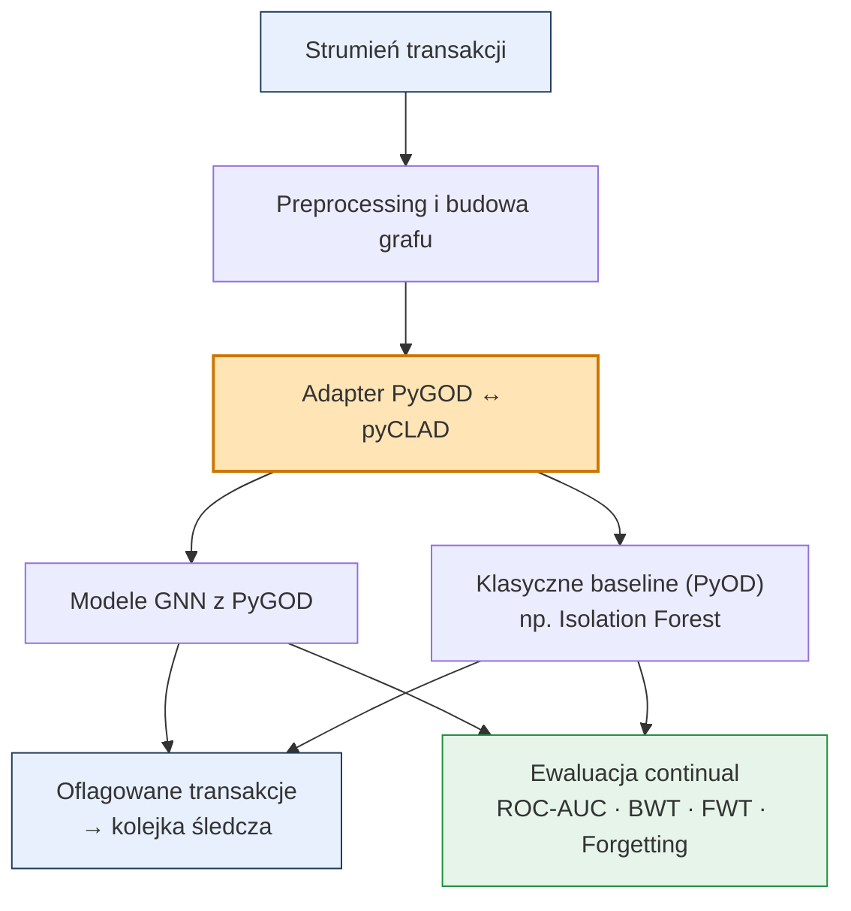

# Adaptacyjne wykrywanie fraudów oparte na grafach
## dla transakcji bankowych i e-commerce

**Franciszek Job · Jakub Ciszewski**
AGH · semestr 8

*Wykrywanie ewoluujących wzorców fraudu w strumieniach transakcji, których klasyczne detektory nie widzą.*

---

## Problem i rozwiązanie

**Problem**
- Banki i payment processory tracą **miliardy dolarów rocznie** na fraudach transakcyjnych.
- Fraudsterzy nieustannie zmieniają taktyki - statyczne modele ML **po cichu degradują się** w ciągu tygodni i miesięcy (*concept drift*).
- Klasyczne detektory tabelaryczne **nie widzą fraudów relacyjnych**: siatek słupów (mule rings), wspólnych urządzeń, klonowania kart, przejmowania kont.

**Nasze rozwiązanie - adaptacyjny system wykrywania fraudów, który:**
1. Wykorzystuje **graf transakcji** (karty ↔ urządzenia ↔ IP ↔ sklepy), żeby wychwytywać fraudy relacyjne.
2. **Uczy się w trybie ciągłym** w miarę jak wzorce fraudu się zmieniają - bez zapominania starych schematów.

**Dla kogo:** banki, sieci kartowe, payment processory, platformy e-commerce.

---

## Mechanizmy AI

**Stosowane w detektorze**
<!-- - **Detektory anomalii oparte na sieciach grafowych** (Graph Neural Networks z PyGOD: DOMINANT, AnomalyDAE, CoLA, GAAN, …) - oceniają każdą transakcję w kontekście jej sąsiedztwa (powiązane konta, urządzenia, sklepy). -->
- **Detektory anomalii oparte na sieciach grafowych** (Graph Neural Networks z PyGOD): oceniają każdą transakcję w kontekście jej sąsiedztwa (powiązane konta, urządzenia, sklepy).
- **Klasyczne baseline jednoklasowe** (np. Isolation Forest z PyOD) - kontrola sanity, że sygnał z grafu faktycznie daje wartość.
- **Strategie continual learning** z pyCLAD - utrzymują detektor sprawnym, gdy fraud ewoluuje.

**Nieużywane - i dlaczego**
- *Systemy regułowe / reprezentacja wiedzy* - schematy fraudu mutują zbyt szybko; ręcznie pisane reguły dezaktualizują się w ciągu miesięcy i nie wychwytują ukrytych wzorców relacyjnych.
- *Uczenie ze wzmocnieniem (RL)* - wykrywanie fraudu to ocenianie pojedynczej transakcji, a nie sekwencyjna decyzja-akcja; nie ma polityki do optymalizacji.

---

## Jak trenujemy - i realistyczne scenariusze banku

**Kategorie (etykiety):** binarne - `fraud` / `legitimate`.

**Atrybuty**
- *Cechy tabelaryczne transakcji:* kwota, czas, waluta, urządzenie, IP, sklep, karta, konto, geo, … (z wysoko ocenianych pipeline'ów preprocessingowych z Kaggle).
- *Krawędzie grafu:* wspólna karta / urządzenie / IP / konto / sklep - ta sama encja dotykająca wielu transakcji.

<!-- **Trzy reżimy nadzoru = trzy realistyczne scenariusze wdrożeniowe**

| Rzeczywistość banku | Dostępne etykiety | Nasz reżim |
|---|---|---|
| Tylko potwierdzona historia "czystych" (bez chargebacków) | Brak dla fraudów | *Semi-supervised / jednoklasowe* |
| Backlog zespołu śledczego | 1 % → 5 % → 10 % → 20 % | *Few-shot* |
| Pełna historia z etykietami (rzadkie, drogie) | Wszystkie | *W pełni nadzorowane* | -->

**Główny dataset - IEEE-CIS Fraud Detection** (Kaggle).
Dlaczego ten: ~590k transakcji; jawne kolumny encji (`card1–6`, `DeviceInfo`, `addr1/2`, `id_30–34`, domena email) tworzą naturalne krawędzie grafu; timestampy transakcji wspierają drift czasowy; duża pula publicznych pipeline'ów preprocessingowych z Kaggle do ponownego użycia.
*Stretch:* walidacja na drugim datasecie z FDB (np. Fraud Ecommerce) dla robustności - tylko jeśli Faza 1 + Faza 2 na IEEE-CIS skończą się na czas.

---

## Architektura systemu



<!-- **Adapter PyGOD ↔ pyCLAD** to nasz kluczowy wkład techniczny - jedno API `fit / predict / score` re-używane w eksperymentach statycznych *i* continual. -->

---

## Jak utrzymujemy detektor sprawnym, gdy fraud ewoluuje

**Dlaczego to ważne.** Detektor wytrenowany na styczniowych fraudach po cichu degraduje się do czerwca. Modelujemy to wprost.


*Podział czasowy* - trening na minionych miesiącach, test na przyszłych. Naśladuje rzeczywiste wdrożenie: wczorajszy model wobec dzisiejszych transakcji.
<!-- - *Podział klastrowy (concept splits)* - KMeans / HDBSCAN w przestrzeni cech definiuje ukryte "schematy" fraudu; zadania przychodzą jedno po drugim. -->

**Metryki**
- *Jakość detekcji:* **ROC-AUC**.
- *Zachowanie continual:* **Backward Transfer (BWT)**, **Forward Transfer (FWT)**, **Forgetting** - czy detektor pamięta stare schematy, przenosi doświadczenie do przodu, czy katastroficznie zapomina?

---

## Uruchomienie

### 1. Setup (jednorazowo)

```bash
# Wymaga uv: https://docs.astral.sh/uv/getting-started/installation/
./setup.sh
```

Skrypt automatycznie:
- instaluje Python 3.12 i zależności w `.venv`
- tworzy katalogi `data/raw/` i `results/`
- pobiera dataset IEEE-CIS jeśli `~/.kaggle/kaggle.json` istnieje

Jeśli nie masz Kaggle CLI, pobierz dataset ręcznie z `kaggle.com/competitions/ieee-fraud-detection/data` i wrzuć pliki do `data/raw/`.

### 2. Trening i ewaluacja

```bash
uv run python experiments/run_experiment.py
```

Skrypt uruchamia pełny pipeline:
1. Ładuje dane i dzieli na 6 okien czasowych
2. Trenuje **baseline** (DOMINANT bez continual learning)
3. Trenuje **Replay** (DOMINANT z buforem historycznych próbek)
4. Dla każdego okna treningowego ewaluuje oba modele na wszystkich oknach
5. Drukuje tabelę metryk i zapisuje wykresy do `results/auc_matrices.png`

### 3. Kluczowe parametry

Edytuj `experiments/run_experiment.py`:

```python
N_WINDOWS = 6             # liczba okien czasowych
MAX_ROWS_PER_WINDOW = 50_000  # rozmiar okna (mniej = szybciej)
```

Edytuj `src/models/adapter.py`:

```python
model_kwargs.setdefault("epoch", 30)  # liczba epok treningu DOMINANT
```

Edytuj `src/graph/builder.py`:

```python
DEFAULT_EDGE_FEATURES = ["card1", "card2", "P_emaildomain", "R_emaildomain"]
# dostępne encje: card1, card2, addr1, addr2, P_emaildomain, R_emaildomain, DeviceInfo
```

---

## Biblioteki i tech stack

- PyGOD
- pyCLAD
- pyOD
- pandas


<!-- | Warstwa | Biblioteka |
|-------|---------|
| Modele anomalii grafowych | **PyGOD** |
| Backend grafowy | **PyTorch Geometric**, PyTorch |
| Protokół continual learning | **pyCLAD** |
| Klasyczne baseline | **PyOD**, scikit-learn |
| Dane / cechy | pandas, numpy, publiczne notebooki Kaggle |
| Dataset | **IEEE-CIS Fraud Detection** (główny) - Kaggle |
| Śledzenie eksperymentów | Weights & Biases *(do ustalenia)* | -->

<!-- --- -->

<!-- ## Produkt

Działający detektor fraudów oparty na grafie · Adapter PyGOD ↔ pyCLAD · Scenariusze continual na publicznych danych bankowych/e-commerce · Dowód, że adaptuje się do driftu. -->
